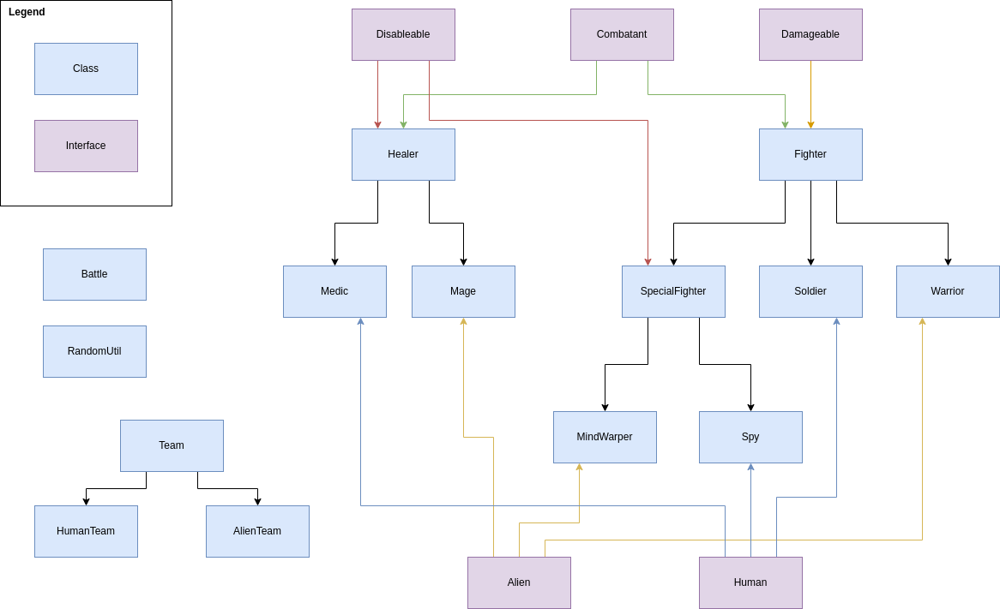

# Your task
This project is broken up into three parts. To find out what you need to do for each part, simply search for “TODO: PART X” in the code, and replace X for what part that you are on. You should be able to run the `Battle.java` to have a complete battle sequence at any individual checkpoint (aka before part 1, after part 1, after part 2, or after part 3).

## Some hints:
* If you ever see a comment that says `{@inheritDoc}`, you can hover your cursor over it to see what it means. It will make VS Code look at the interfaces and parent classes to get the appropriate documentation.
* Look at “RandomUtil.java” as it will have some really helpful methods.

# Overall game description
We are implementing a battle between humans and aliens. Each battle is 4 humans vs 4 aliens in a text battle game. Each team (see `HumanTeam` and `AlienTeam`) consists of:

* Two fighters: Human fighters are called soldiers; Alien fighters are called warriors.
* One special fighter: Human special fighters are called spies; Alien special fighters are called mind warpers.
* One healer: Human healers are called medics; Alien healers are called mages.

The first team to eliminate the other team’s fighters (including special fighters) is the winner.

# Class Hierarchy

## Differences between Human and Alien classes
The only real difference between these two classes is that humans have a home town and aliens have a home world. The rest of the mechanics are the same.

## Fighter classes: Soldier and Warrior
These classes simply have the ability to attack an opponent. Each fighter has a health value, a max health value, and an attack power. The health value must stay between 0 and their max health, inclusively. When attacking, they do a random amount of damage between half of their attack power and their full attack power. They are unable to damage the Healer classes.

## SpecialFighter classes: Spy and MindWarper
These classes are like the Fighter classes above except for two main differences:
1. When attacking, they do a random amount of damage between 0 and their full attack power.
2. They have the ability to infiltrate an opponent. This means:
   * 20% of the time, the special fighter does 0 damage and is disabled (unable to do anything) for 5 turns.
   * 50% of the time, the special fighter causes the opponent to damage themselves for twice of the opponent’s attack power.
   * 30% of the time the special fighter does 0 damage

## Healer classes: Medic and Mage
These classes are much different than the other classes in the game. They don’t take damage. They don’t cause damage. Each healer has two moves:
* They can heal, which heals a teammate a random number between half of their healing power and their full healing power.
* They can sacrifice, which heals a teammate to 100% health, but disables (unable to do anything) themselves for 5 turns.

# Challenge questions if you finish early
* What would you change to make the characters more balanced?
* There are a couple of keywords in the code that we haven’t shown you. What are they and what do they mean?
* Create your own additional class with a different set of moves and add them to the battle.
* Explain what you like and what you don’t like about the class/interface structure and what you would change.
* Why did we use interfaces for some things and classes for other things?